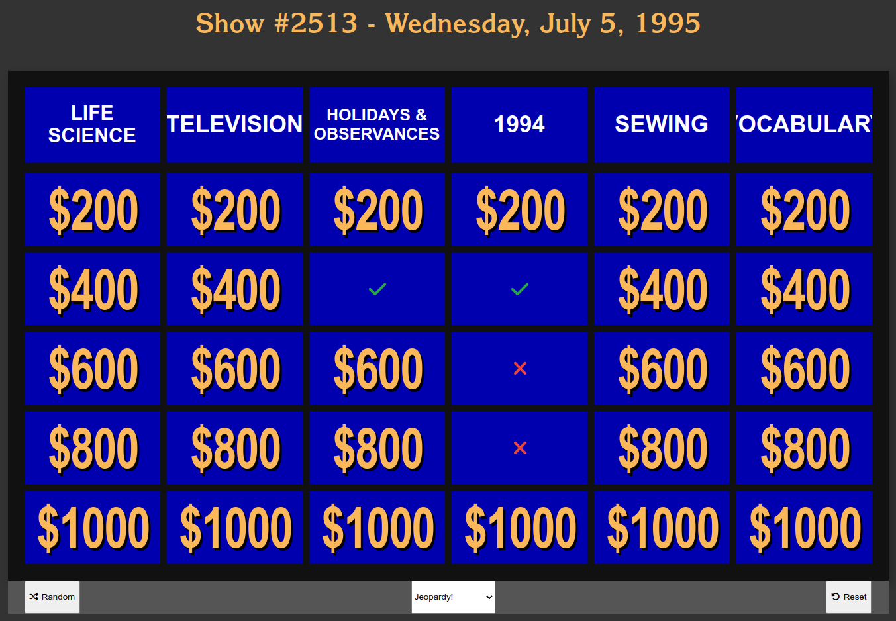
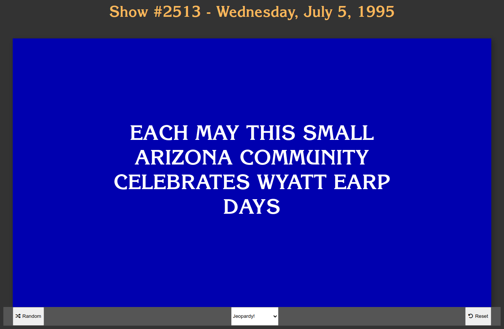
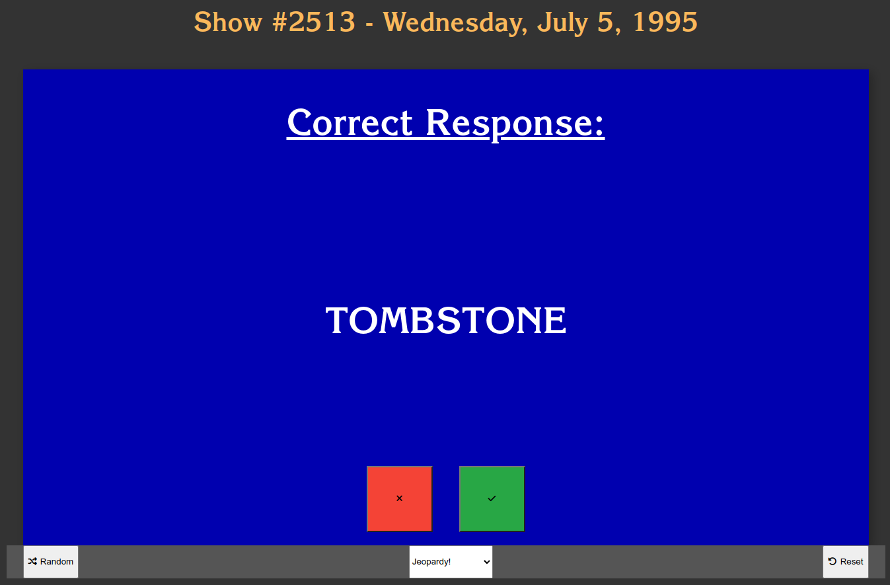

# JeopardyUI

Web interface for playing and practicing existing Jeopardy! games. The game board is intended to be a replica (fonts, dimensions etc.) of the board on the show. Games are fetched from [the backend](https://github.com/aflorzy/jeopardy-parser-backend), which extracts game and clue data from J! Archive.

Each game has 2 rounds (Final Jeopardy! not yet implemented). Each round has 6 categories. Each category has 5 clues (exception when TV round was not finished due to insufficient time).

Category names are listed in the top row of the game board table. Category clues are initially covered by dollar values which correspond to the difficulty of the clue. When the tile is clicked, the game board is covered in a blue canvas containing the clue text. When the canvas is clicked, the text changes to the correct response, along with buttons to indicate a Correct or Incorrect response.

After the question has been answered, the response will replace the dollar value on the tile, indicating the clue has already been viewed and answered. The clue tile status can be updated or reset by hovering the tile and clicking one of the options that appears.

## To Use

Ensure NodeJS 18.13.0 or later is installed on your system. Clone this repository by running `git clone https://github.com/aflorzy/jeopardy-ui.git` in a terminal/command prompt. Navigate into the cloned directory and run `npm start`. The server will run on port 4200, so navigate to `http://localhost:4200/` in a web browser to access the web interface.

You will be greeted by the previous game initially after each page refresh. This game is stored in the browser, and reduces the number of calls to the backend and J! Archive.

Get a random game by clicking the Random button below the game board.
Switch between Jeopardy! and Double Jeopardy! by selecting between these in the dropdown below the game board.
Reset the game board by clicking the reset button in the actions bar below the game board.

## Screenshots

## License
This software is released under the MIT License. See the [LICENSE.md](./LICENSE.md) file for more information.
